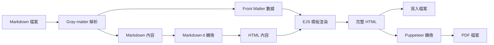

# Resume Generator


一個基於 EJS 模板引擎的履歷生成器，可以將 Markdown 格式的履歷內容轉換為專業的 HTML 和 PDF 格式。

## 檔案結構

```
ejs/
├── build.js               # 腳本
├── package.json
├── pnpm-lock.yaml
├── content/               # 履歷內容
│   ├── resume.md
│   ├── resume_en.md
├── templates/            # 模板檔案
│   ├── resume.ejs        # HTML 模板
│   └── styles.css        # CSS 樣式檔案
└── output/              # 輸出檔案 (自動生成)
    ├── resume.html      # 生成的 HTML 履歷
    ├── resume.pdf       # 生成的 PDF 履歷
    └── styles.css       # 複製的樣式檔案
```

## 技術架構

### 主要依賴

- **EJS** - HTML 模板引擎
- **Markdown-it** - Markdown 轉 HTML 解析器
- **Gray-matter** - YAML Front Matter 解析器
- **Puppeteer** - 無頭瀏覽器，用於生成 PDF
- **fs-extra** - 檔案系統操作工具

### 工作流程



## 安裝與使用

### 1. 安裝依賴

```bash
# 使用 pnpm (推薦)
pnpm install

# 或使用 npm
npm install
```

### 2. 編輯履歷內容

編輯 `content/resume.md` (中文版) 或 `content/resume_en.md` (英文版)：

```markdown
---
name: '你的姓名'
title: '職位標題'
email: 'your.email@example.com'
phone: '+886 912 345 678'
linkedin: 'linkedin.com/in/your-profile'
---

## 專業簡介

在這裡寫你的專業簡介...

## 工作經歷

### 職位名稱 | 公司名稱

_工作時間_

- 工作內容描述...
```

### 3. 建置履歷

```bash
# 執行建置命令
pnpm run build

# 或直接執行
node build.js
```

### 4. 查看結果

建置完成後，在 `output/` 資料夾中會生成：

- `resume.html` - HTML 版本履歷
- `resume.pdf` - PDF 版本履歷

## 自定義樣式

### 修改 CSS 樣式

編輯 `templates/styles.css` 來自定義履歷的外觀：

```css
/* 調整字體大小 */
body {
  font-size: 11px;
}

/* 調整標題樣式 */
h2 {
  color: #333;
  border-bottom: 2px solid #000;
}
```

### 修改 HTML 模板

編輯 `templates/resume.ejs` 來調整 HTML 結構：

```html
<!DOCTYPE html>
<html>
  <head>
    <title><%= name %> - 履歷</title>
    <link rel="stylesheet" href="styles.css" />
  </head>
  <body>
    <header>
      <h1><%= name %></h1>
      <h2><%= title %></h2>
    </header>
    <main><%- content %></main>
  </body>
</html>
```

## Front Matter 配置

在 Markdown 檔案頂部的 YAML 區塊中，你可以設定：

```yaml
---
name: '姓名' # 必填：顯示在標題
title: '職位' # 必填：顯示在副標題
email: 'email@example.com' # 聯絡資訊
phone: '+886 xxx xxx xxx' # 電話號碼
linkedin: 'linkedin.com/in/...' # LinkedIn 連結
---
```

### PDF 設定調整

在 `build.js` 中調整 PDF 生成設定：

```javascript
await page.pdf({
  path: outputPdfPath,
  format: 'A4', // 紙張大小
  printBackground: true, // 列印背景
  margin: {
    // 邊距設定
    top: '10mm',
    right: '10mm',
    bottom: '10mm',
    left: '10mm',
  },
});
```

## 常見問題

### Q: 如何讓履歷內容塞進一頁？

A: 調整 `templates/styles.css` 中的間距：

```css
/* 減少段落間距 */
p {
  margin-bottom: 4px;
}

/* 減少標題間距 */
h2 {
  margin: 12px 0 6px 0;
}
```

### Q: 如何更改字體？

A: 在 `styles.css` 中修改 `font-family`：

```css
body {
  font-family: 'Arial', sans-serif;
}
```

### Q: PDF 生成失敗怎麼辦？

A: 確保：

1. Puppeteer 已正確安裝
2. 系統有足夠記憶體
3. HTML 檔案路徑正確

## Roadmap (發展藍圖)

- [x] 核心功能：從 Markdown 生成 PDF
- [ ] 擴充模板：支援多種履歷樣式，並允許使用者快速切換
- [ ] CI/CD 整合：設定自動化工作流 (Workflow)，在程式碼推送到特定分支時，自動打包並發布 (Release) 最新的 PDF 檔案
